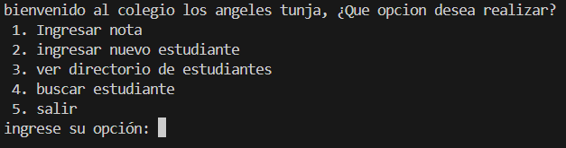
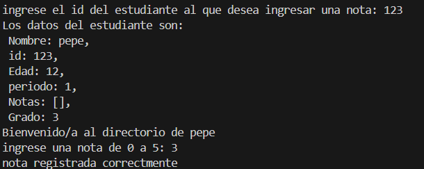
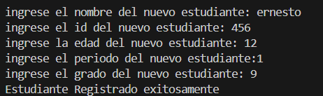
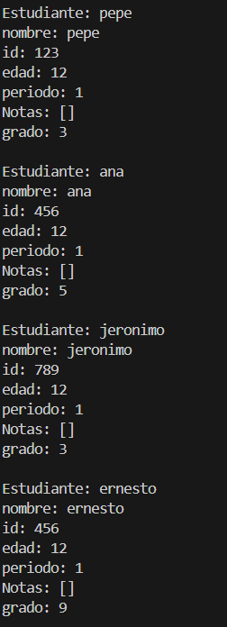
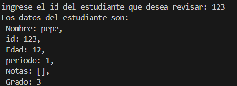
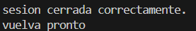

# USER GUIDE

- **Instrucciones de Instalación y Ejecución:**

    Desde el Bash de git se ingresa hasta la carpeta que se desee tener el repositorio, desde Notion se copia la url del repositorio remoto, este se clona con el comando "git clone (url del repositorio)" en git bash , posteriormente el repositorio quedara guardado localmente y se inicia en el branch main en la carpeta, luego se ingresa a la aplicacion configurada para observar el codigo y el programa.
    
- **Uso del Programa:**

    El programa inicia con un menu en bucle donde uno escoge la funcion que desee realizar colocando los numeros "1,2,3,4,5"; hay diferentes funciones que puede realizar el programa como: 

    -"agreagar nota": esta funcion se realiza con la opcion "1" y lo que va a hacer es pedir el id del estudiante y la nota que desea agregar, posterior a esto el usuario es enviado de nuevo al menu.

    -"ingresar nuevo estudiante": esta funcion se realiza con la opcion "2" y lo que va a hacer es pedir el id, nombre, edad, periodo y grado del nuevo estudiante, posterior a esto el usuario es enviado de nuevo al menu.

    -"ver directorio de estudiantes": esta funcion se realiza con la opcion "3" y lo que va a hacer es imprimir la informacion de todos los estudiantes, posterior a esto el usuario es enviado de nuevo al menu.

    -"buscar estudiante": esta funcion se realiza con la opcion "4" y lo que va a hacer es pedir el id del estudiante y va a imprimir          la informacion de este, posterior a esto el usuario es enviado de nuevo al menu.

    -"salir": esta funcion se realiza con la opcion "5" y lo que hace es romper el bucle del menú acabando con el funcionamiento del programa
- **Ejemplos:**

    Para entender lo realizado en los ejemplos se debe leer la seccion de uso del programa.    
    Lo primero que hace el programa al ejecutarse es mostrar el menu:

    

    Un ejemplo de uso para la opcion 1 seria:
    
    

    Un ejemplo de la opcion 2 es:

    

    Un ejemplo de la opcion 3 seria:

    

    Un ejemplo de la opcion 4 es:

    

    y finalmente la opcion 5:

    
    - Proporciona ejemplos prácticos que muestren el funcionamiento del programa.